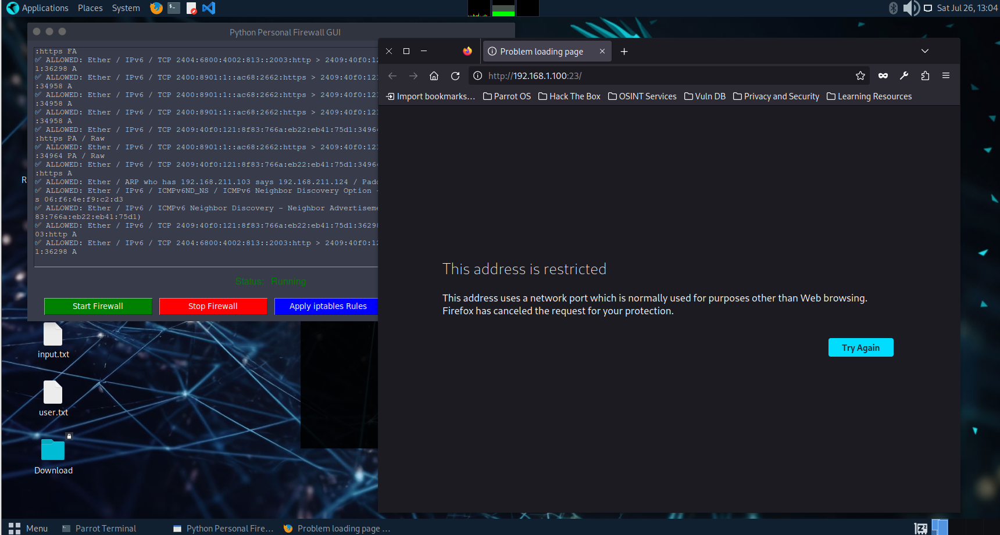

# 🔥 Python Personal Firewall (GUI + iptables)

A lightweight, Python-based personal firewall that provides **real-time network monitoring**, **rule-based blocking**, and **system-level packet filtering** using `iptables`. Built with **Scapy**, **Tkinter**, and standard Python modules, this tool offers both a GUI and CLI interface for managing and securing your local network traffic.

---

## 💡 Features

- 🧠 **Custom Rule Engine**  
  Block IPs, ports, and protocols using simple JSON rules.

- 📦 **Scapy-Powered Packet Sniffer**  
  Detects TCP, UDP, and ICMP traffic in real-time.

- 🛡️ **GUI Control Panel**  
  Start, pause, and stop the firewall using a user-friendly Tkinter interface.

- 🔥 **iptables Integration**  
  Automatically applies and manages `iptables` rules at the system level.

- 🧾 **Traffic Logging**  
  Logs all blocked or suspicious packets to `logs/blocked.log`.

---

## 📁 Project Structure

```bash
personal_firewall/
├── firewall.py # Sniffs and filters packets based on rules
├── firewall_gui.py # GUI to start/stop firewall and manage iptables
├── iptables_blocker.py # CLI-based iptables rule manager
├── rules.json # Custom IP/port/protocol blocking rules
├── logs/
│ └── blocked.log # Logs of blocked/suspicious packets
├── requirements.txt # Required Python libraries
└── Readme.md # Project overview and usage instructions

```

## 🖼️ Screenshot

### Firewall GUI & Blocked Access Demonstration



